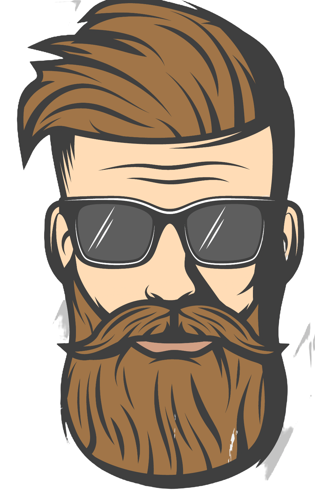

  <h1>🚧 Contrução 🚧</h1>

 

  

  <h3 align="center">Barber Shop</h3>

  

     
    <a href="" target="_blank" rel="noreferrer">Demo do projeto</a>
  

## Sobre o Projeto
 
<!--[![Screen Shot][product-screenshot]](/mobile.png)
[![Screen Shot][product-screenshot]](/pc.png)-->

   
   
  <!-- -->

 

 Sobre o aplicativo: 
 

- Modelo de uma landing-page para Barbearia

(<a href="#topo">Para o topo</a>)

### Desenvolvido com :

